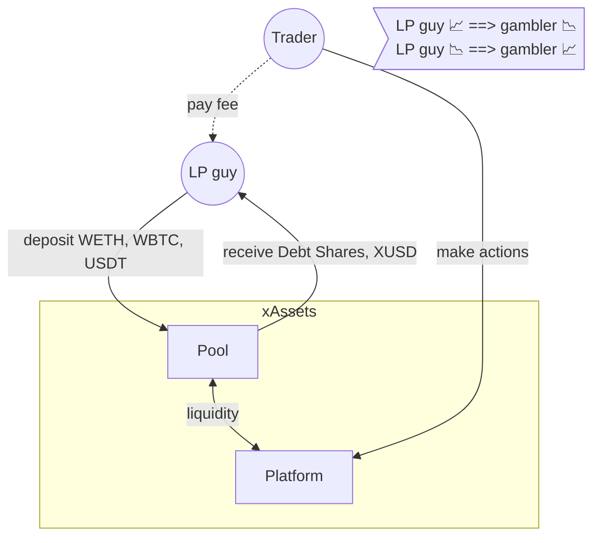

```mermaid

flowchart TD

provider(("LP guy")) -- deposit WETH, WBTC, USDT --> Pool
    subgraph subGraph0["xAssets"]
        Platform["Platform"]
        Pool["Pool"]
    end

Pool -- receive Debt Shares, XUSD --> provider
Pool <-- liquidity --> Platform

gambler(("Trader")) -- "make actions" --> Platform
gambler -. "pay fee" .-> provider

id1>
    LP guy 📈 ==> gambler 📉
    LP guy 📉 ==> gambler 📈
]


```
