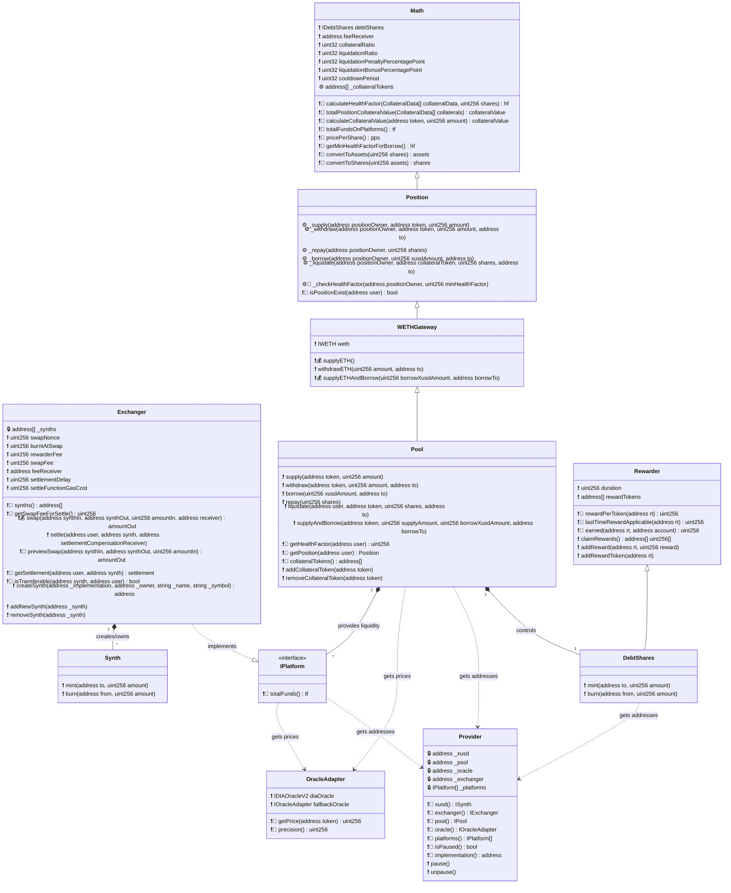

```mermaid
classDiagram

	class Synth {
		❗ mint(address to, uint256 amount)
		❗ burn(address from, uint256 amount)
	}

	%% class ERC20Upgradeable {
	%% }

	class OracleAdapter {
		❗ IDIAOracleV2 diaOracle
		❗ IOracleAdapter fallbackOracle
		❗👀 getPrice(address token) uint256
		❗🧮 precision() uint256
	}

	class Exchanger {
		🔒 address[] _synths
		❗ uint256 swapNonce
		❗ uint256 burntAtSwap
		❗ uint256 rewarderFee
		❗ uint256 swapFee
		❗ address feeReceiver
		❗ uint256 settlementDelay
		❗ uint256 settleFunctionGasCost
		❗👀 synths() address[]
		❗👀 getSwapFeeForSettle() uint256
		❗💰 swap(address synthIn, address synthOut, uint256 amountIn, address receiver) amountOut
		❗ settle(address user, address synth, address settlementCompensationReceiver)
		❗👀 previewSwap(address synthIn, address synthOut, uint256 amountIn) amountOut
		❗👀 getSettlement(address user, address synth) settlement
		❗👀 isTransferable(address synth, address user) bool
		❗ createSynth(address _implementation, address _owner, string _name, string _symbol) address
		❗ addNewSynth(address _synth)
		❗ removeSynth(address _synth)
	}

	class Provider {
		🔒 address _xusd
		🔒 address _pool
		🔒 address _oracle
		🔒 address _exchanger
		🔒 IPlatform[] _platforms
		❗👀 xusd() ISynth
		❗👀 exchanger() IExchanger
		❗👀 pool() IPool
		❗👀 oracle() IOracleAdapter
		❗👀 platforms() IPlatform[]
		❗👀 isPaused() bool
		❗👀 implementation() address
		❗ pause()
		❗ unpause()
	}

	class Math {
		❗ IDebtShares debtShares
		❗ address feeReceiver
		❗ uint32 collateralRatio
		❗ uint32 liquidationRatio
		❗ uint32 liquidationPenaltyPercentagePoint
		❗ uint32 liquidationBonusPercentagePoint
		❗ uint32 cooldownPeriod
		⚙️ address[] _collateralTokens
		❗👀 calculateHealthFactor(CollateralData[] collateralData, uint256 shares) hf
		❗👀 totalPositionCollateralValue(CollateralData[] collaterals) collateralValue
		❗👀 calculateCollateralValue(address token, uint256 amount) collateralValue
		❗👀 totalFundsOnPlatforms() tf
		❗👀 pricePerShare() pps
		❗👀 getMinHealthFactorForBorrow() hf
		❗👀 convertToAssets(uint256 shares) assets
		❗👀 convertToShares(uint256 assets) shares
	}

	class Position {
		⚙️ _supply(address positionOwner, address token, uint256 amount)
		⚙️ _withdraw(address positionOwner, address token, uint256 amount, address to)
		⚙️ _repay(address positionOwner, uint256 shares)
		⚙️ _borrow(address positionOwner, uint256 xusdAmount, address to)
		⚙️ _liquidate(address positionOwner, address collateralToken, uint256 shares, address to)
		⚙️👀 _checkHealthFactor(address positionOwner, uint256 minHealthFactor)
		❗👀 isPositionExist(address user) bool
	}

	class WETHGateway {
		❗ IWETH weth
		❗💰 supplyETH()
		❗ withdrawETH(uint256 amount, address to)
		❗💰 supplyETHAndBorrow(uint256 borrowXusdAmount, address borrowTo)
	}

	class Pool {
		❗ supply(address token, uint256 amount)
		❗ withdraw(address token, uint256 amount, address to)
		❗ borrow(uint256 xusdAmount, address to)
		❗ repay(uint256 shares)
		❗ liquidate(address user, address token, uint256 shares, address to)
		❗ supplyAndBorrow(address token, uint256 supplyAmount, uint256 borrowXusdAmount, address borrowTo)
		❗👀 getHealthFactor(address user) uint256
		❗👀 getPosition(address user) Position
		❗👀 collateralTokens() address[]
		❗ addCollateralToken(address token)
		❗ removeCollateralToken(address token)
	}

	class Rewarder {
		❗ uint256 duration
		❗ address[] rewardTokens
		❗👀 rewardPerToken(address rt) uint256
		❗👀 lastTimeRewardApplicable(address rt) uint256
		❗👀 earned(address rt, address account) uint256
		❗ claimRewards() address[] uint256[]
		❗ addReward(address rt, uint256 reward)
		❗ addRewardToken(address rt)
	}

	class DebtShares {
		❗ mint(address to, uint256 amount)
		❗ burn(address from, uint256 amount)
	}

	class IPlatform {
        <<interface>>

		❗👀 totalFunds() tf
    }

    Exchanger ..|> IPlatform : implements

	%% ERC20Upgradeable <|-- Synth
	%% ERC20Upgradeable <|-- Rewarder

	Math <|-- Position

	Position <|-- WETHGateway

	WETHGateway <|-- Pool

	Rewarder <|-- DebtShares

	Exchanger "1" *-- "*" Synth : creates/owns

    Pool "1" *-- "1" DebtShares : controls

	DebtShares ..> Provider : gets addresses
	Pool ..> Provider : gets addresses
    IPlatform ..> Provider : gets addresses

    IPlatform ..> OracleAdapter : gets prices
	Pool ..> OracleAdapter : gets prices

	Pool "1" *-- "*" IPlatform : provides liquidity

```
