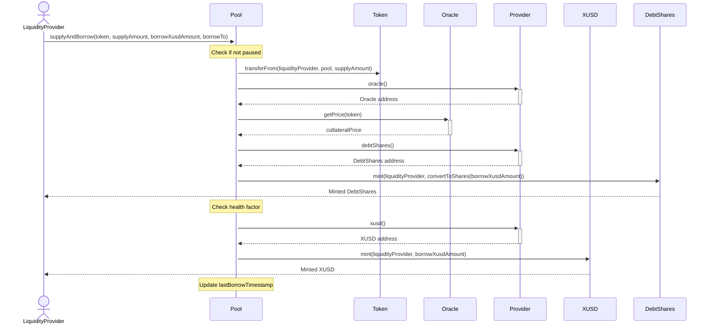

```mermaid
sequenceDiagram
actor LiquidityProvider
participant Pool
participant Token
participant Oracle
participant Provider
participant XUSD
participant DebtShares

    LiquidityProvider ->>+ Pool: supplyAndBorrow(token, supplyAmount, borrowXusdAmount, borrowTo)

    Note over Pool: Check if not paused

    Pool ->> Token: transferFrom(liquidityProvider, pool, supplyAmount)

    Pool ->>+ Provider: oracle()
    Provider -->>- Pool: Oracle address

    Pool ->>+ Oracle: getPrice(token)
    Oracle -->>- Pool: collateralPrice

    Pool ->>+ Provider: debtShares()
    Provider -->>- Pool: DebtShares address

    Pool ->> DebtShares: mint(liquidityProvider, convertToShares(borrowXusdAmount))
    DebtShares -->> LiquidityProvider: Minted DebtShares

    Note over Pool: Check health factor

    Pool ->>+ Provider: xusd()
    Provider -->>- Pool: XUSD address

    Pool ->> XUSD: mint(liquidityProvider, borrowXusdAmount)
    XUSD -->> LiquidityProvider: Minted XUSD

    Note over Pool: Update lastBorrowTimestamp
```
