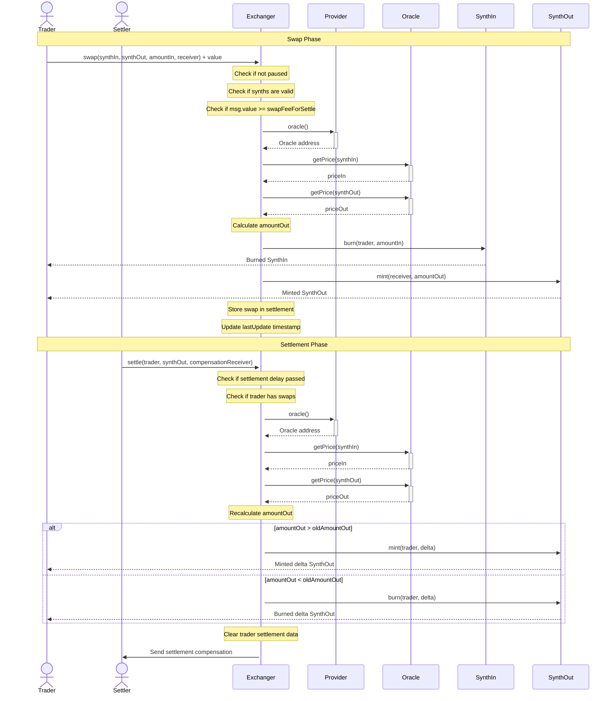

```mermaid
sequenceDiagram
actor Trader
actor Settler
participant Exchanger
participant Provider
participant Oracle
participant SynthIn
participant SynthOut

    Note over Trader, SynthOut: Swap Phase
    Trader ->>+ Exchanger: swap(synthIn, synthOut, amountIn, receiver) + value

    Note over Exchanger: Check if not paused
    Note over Exchanger: Check if synths are valid
    Note over Exchanger: Check if msg.value >= swapFeeForSettle

    Exchanger ->>+ Provider: oracle()
    Provider -->>- Exchanger: Oracle address

    Exchanger ->>+ Oracle: getPrice(synthIn)
    Oracle -->>- Exchanger: priceIn
    Exchanger ->>+ Oracle: getPrice(synthOut)
    Oracle -->>- Exchanger: priceOut

    Note over Exchanger: Calculate amountOut

    Exchanger ->> SynthIn: burn(trader, amountIn)
    SynthIn -->> Trader: Burned SynthIn

    Exchanger ->> SynthOut: mint(receiver, amountOut)
    SynthOut -->> Trader: Minted SynthOut

    Note over Exchanger: Store swap in settlement
    Note over Exchanger: Update lastUpdate timestamp

    Note over Trader, SynthOut: Settlement Phase
    Settler ->>+ Exchanger: settle(trader, synthOut, compensationReceiver)

    Note over Exchanger: Check if settlement delay passed
    Note over Exchanger: Check if trader has swaps

    Exchanger ->>+ Provider: oracle()
    Provider -->>- Exchanger: Oracle address

    Exchanger ->>+ Oracle: getPrice(synthIn)
    Oracle -->>- Exchanger: priceIn
    Exchanger ->>+ Oracle: getPrice(synthOut)
    Oracle -->>- Exchanger: priceOut

    Note over Exchanger: Recalculate amountOut

    alt amountOut > oldAmountOut
        Exchanger ->> SynthOut: mint(trader, delta)
        SynthOut -->> Trader: Minted delta SynthOut
    else amountOut < oldAmountOut
        Exchanger ->> SynthOut: burn(trader, delta)
        SynthOut -->> Trader: Burned delta SynthOut
    end

    Note over Exchanger: Clear trader settlement data
    Exchanger ->> Settler: Send settlement compensation
```
